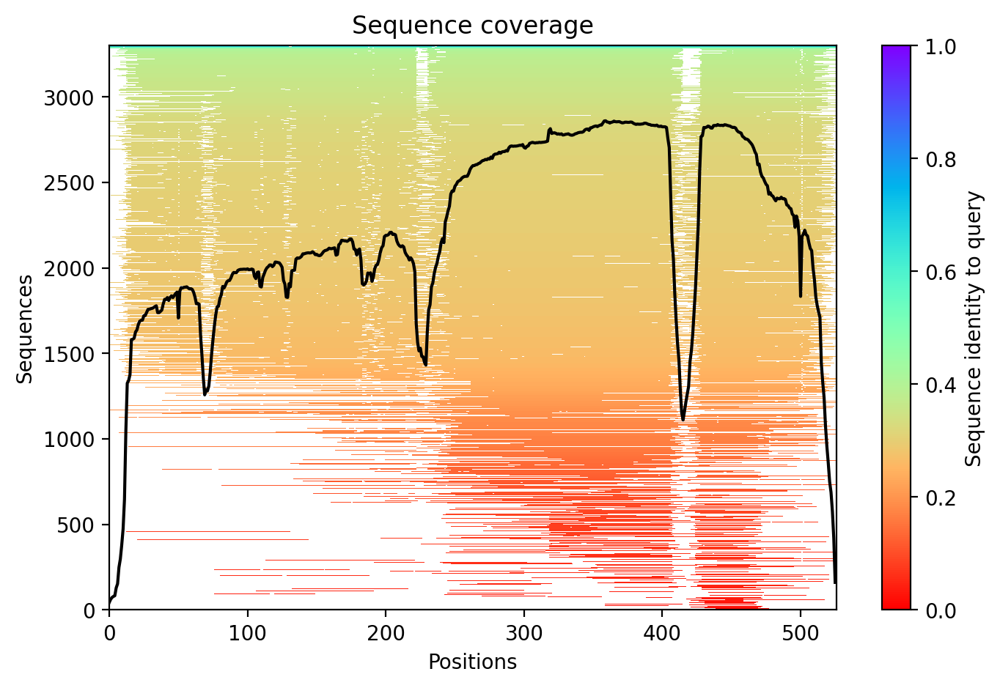
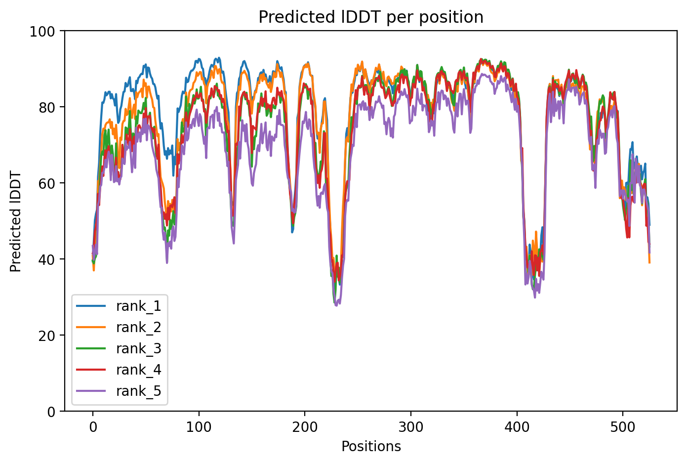
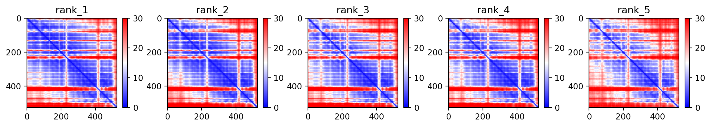

```{r setup, echo=FALSE}
## Setup
#Setup R env. Load packages and set default image export formats, size and resolution.

knitr::opts_chunk$set(echo = TRUE,
                      fig.height = 16, 
                      fig.width = 12, 
                      dev = c("png", "pdf"),
                      dpi = 1000)
library(r3dmol)
options(scipen = 999) #Prevent scientific notation
```


# Protein 3D structure

Average structure confidence: <span style="color:#65cbf3">High</span>

```{r plot_AlphaFold2_structure, echo=FALSE}
pdb.file  <- "0.pdb"

width=800
height=800

## Setup initial protein 3D viewer
# - Color by by b-chain info (i.e., AlphaFold2 prediction confidence)
viewer <- r3dmol(
    width=width,
    height=height,
  viewer_spec = m_viewer_spec(
    cartoonQuality = 10,
    lowerZoomLimit = 50,
    upperZoomLimit = 350,
  ),
) %>%
  # Add model to scene
  m_add_model(data = pdb.file, format = "pdb") %>%
  # Zoom to encompass the whole scene
  m_zoom_to() %>%
  # Set style of structures
  m_set_style(style = m_style_cartoon(
    colorfunc = "
        function(atom) {
          if (atom.b < 50) {return '#ef7c45'};
          if (atom.b < 70 && atom.b >= 50) {return '#f8db13'};
          if (atom.b < 90 && atom.b >= 70) {return '#65cbf3'};
          if (atom.b >= 90) {return '#2a54d6'};
          return 'white';
        }"
  ))

# - Color by by chain (i.e., we have a multimeric complex; color each protein in complex as a separate color)

## Create interactive results HTML
legend <- htmltools::img(src = knitr::image_uri("AlphaFold2-legend.png"), 
                         alt = "logo", 
                         style = paste('float: bottom;padding-bottom:0px;height:',40*4,'px;width:',160*4,'px', sep="")
                         )

viewer <- htmlwidgets::prependContent(viewer, legend)
viewer
```








# Session Info

```{r ressionInfo, echo=FALSE}
sessionInfo()
```

